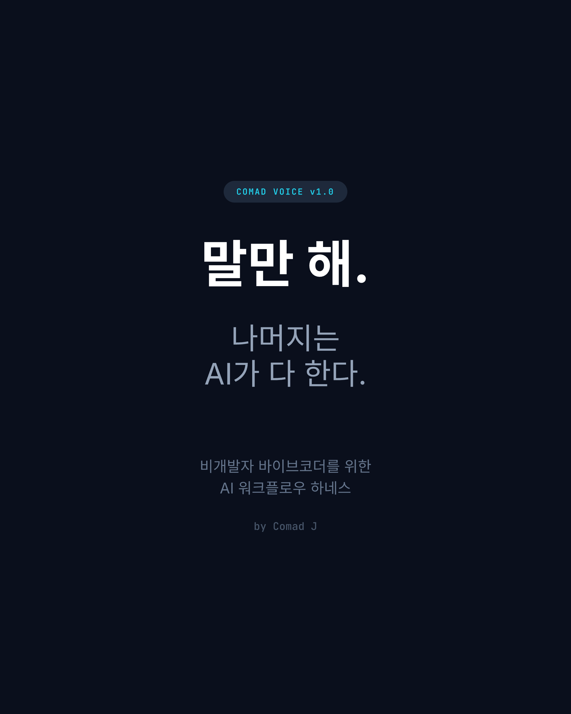

<p align="center">
  
</p>

<h1 align="center">Comad Voice</h1>

<p align="center">
  <strong>"Just say it. AI does the rest."</strong>
</p>

<p align="center">
  <a href="LICENSE"></a>
  <a href="https://github.com/kinkos1234/comad-voice/releases"></a>
  
  
</p>

<p align="center">
  AI workflow harness for non-developer vibe coders.<br>
  Unifies Claude Code + Codex + Gemini into a single voice —<br>
  throw one big topic and it auto-runs: research → experiment → refactor → ship.
</p>

<p align="center">
  <a href="README.md">한국어</a> · English
</p>

---

## Table of Contents

- [Comad Series](#comad-series)
- [Who Is This For?](#who-is-this-for)
- [What Changes?](#what-changes)
- [Prerequisites](#prerequisites)
- [Installation](#installation)
- [Usage](#usage)
- [Command Cheatsheet](#command-cheatsheet)
- [How It Works](#how-it-works)
- [Credits](#credits)
- [Contributing](#contributing)
- [License](#license)

---

## Comad Series

| Name            | Role                              |
| --------------- | --------------------------------- |
| **ComadEye**    | Future Simulator (see)            |
| **Comad Ear**   | Discord Bot Server (listen)       |
| **Comad Brain** | Knowledge Ontology (think)        |
| **Comad Voice** | AI Workflow Harness (speak)       |

---

## Who Is This For?

- People who don't code but want to build projects with AI
- Subscribers of Claude Max / ChatGPT Plus / Google Pro who underutilize them
- Vibe coders who don't know what to ask

## What Changes?

**Before:** "Improve this" → Claude fixes one thing and stops

**After:** "Review this" → Claude auto-diagnoses, shows improvement cards, you pick a number, and it runs an autonomous experiment loop

---

## Prerequisites

| Tool                       | Required | Description                                    |
| -------------------------- | -------- | ---------------------------------------------- |
| **Claude Code**            | Yes      | Claude Max subscription recommended (Opus)     |
| **oh-my-claudecode (OMC)** | Yes      | Multi-agent orchestration                      |
| **gstack**                 | Yes      | Sprint workflow + QA                           |
| **Codex CLI**              | Optional | Parallel task delegation (works without it)    |
| **tmux**                   | Optional | Required for Codex CLI parallel execution      |

### Pre-installation

```bash
# OMC (inside Claude Code)
# → Type "setup omc" in Claude Code

# gstack
# → See https://github.com/anthropics/gstack

# Codex CLI (optional)
npm install -g @openai/codex

# tmux (optional, macOS)
brew install tmux
```

---

## Installation

```bash
curl -fsSL https://raw.githubusercontent.com/kinkos1234/comad-voice/main/install.sh | bash
```

Or manual install:

```bash
git clone https://github.com/kinkos1234/comad-voice.git
cd comad-voice
./install.sh
```

What the installer does:

1. Appends Comad Voice config to `~/.claude/CLAUDE.md`
2. Optionally copies memory templates to your current project

---

## Usage

### 1. "Review this" — Easiest Start

Open Claude Code in your project folder and just say:

```
검토해봐
```

(or in English: "review this", "health check", "diagnose")

Claude will:

1. Analyze your codebase
2. Show improvement areas as cards
3. Just pick a number — the experiment loop runs automatically

### 2. "Full-cycle" — Throw a Big Topic

```
Improve the report quality of ComadEye overall
```

The 6-stage pipeline auto-executes:

```
RESEARCH → DECOMPOSE → EXPERIMENT → INTEGRATE → POLISH → DELIVER
```

### 3. Local Model Wait Time Utilization

While local LLM tests are running:

```
Prepare the next experiment code while waiting
```

Claude auto-manages background execution + parallel work.

### 4. Session Management

For long tasks, split sessions:

```
Save results to memory and start a new session
```

---

## Command Cheatsheet

| What you want              | Just say this                       |
| -------------------------- | ----------------------------------- |
| Diagnose current state     | "검토해봐", "review this"           |
| Auto-run big topic         | "풀사이클", "full-cycle"            |
| Iterative experiments      | "autoresearch", "experiment"        |
| Save and restart session   | "save to memory, new session"       |
| Use wait time              | "prepare next experiment"           |
| Codex parallel tasks       | Auto-detected (delegates if independent) |

---

## How It Works

### Full-Cycle Pipeline

```
User: "Improve report quality"
         ↓
[RESEARCH] Analyze current code + research related techniques
         ↓
[DECOMPOSE] Break into subtasks + auto-judge dependencies
   🟢 Independent → Delegate to Codex in parallel
   🔴 Dependent → Claude runs sequentially
   🟡 Needs context → Claude handles directly
         ↓
[EXPERIMENT] autoresearch loop per subtask
         ↓
[INTEGRATE] Merge best results + refactor
         ↓
[POLISH] QA + performance + documentation
         ↓
[DELIVER] Create PR + retrospective
```

### Automatic Dependency Analysis

Non-developers don't need to judge "is this independent or dependent?"
Claude auto-analyzes using 5 criteria:

1. File overlap between tasks?
2. Uses functions created by other tasks?
3. Takes output from other tasks as input?
4. Must run in a specific order?
5. Modifies shared state?

### Session Memory

Prevents context pollution in long sessions:

- Session swap recommended every 5-7 experiments
- Important results auto-saved to memory files
- Auto-restored in new sessions

---

## Credits

Comad Voice is a harness built on top of these open-source tools:

- **[oh-my-claudecode (OMC)](https://github.com/anthropics/oh-my-claudecode)** — Multi-agent orchestration
- **[gstack](https://github.com/anthropics/gstack)** — Sprint workflow + browser QA
- **autoresearch** — Autonomous experiment loop (Andrej Karpathy inspired)
- **pumasi** — Codex CLI parallel delegation
- **Nexus** — Unified autonomous development system

> Thanks to the original authors of these tools.
> Comad Voice organizes these workflows so non-developers can use them easily.

### Inspiration

- [Andrej Karpathy — "Software in the era of AI"](https://www.youtube.com/watch?v=kwSVtQ7dziU)
  - Generation + Verification loop
  - Autonomy Slider concept
  - "Partial autonomy" for AI collaboration

---

## Contributing

Contributions are welcome! See [CONTRIBUTING.md](CONTRIBUTING.md) for details.

---

## License

[MIT](LICENSE) — Free to use, modify, and distribute.

---

<p align="center">
  <strong>Made with AI by Comad J</strong>
</p>
